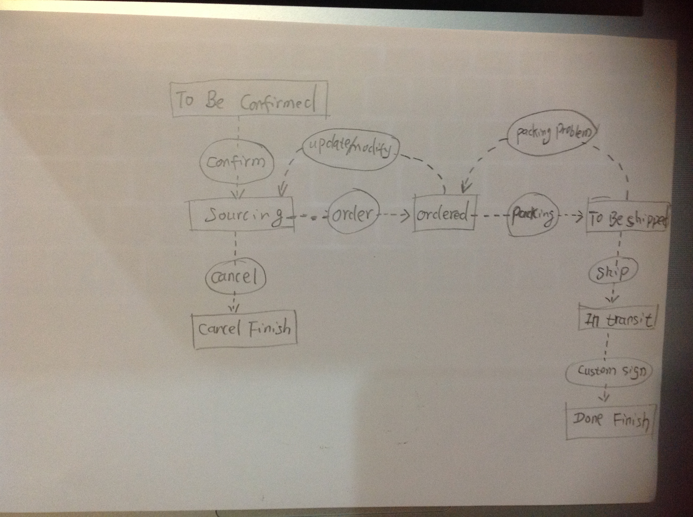

#Lucy's Store Requirement Specification

*********

##一个典型的订单生命周期
********  

客户通过邮件或短消息下订单。**此时订单是初始状态（To Be Confirmed）**。  

我们收到订单后，首先需要确认订单详细信息，包括订单的产品规格：型号，颜色，材料，数量，是否copy。过程中，需要邮件或电话与客户反复确认。**客户明确订单之后，此时订单是已确认状态或询价状态或sourcing状态（Sourcing）**。这时候用户还可以取消订单，可能原因是价格、交货周期不符合或则其他，那么订单进入**Cancel Finish**状态。  

订单确认明确之后，开始找供应商询价（专业术语是sourcing），比对各个供应商的价格和质量，寻找出一个或几个性价比最优的产品，发给客户确认。如果不是现货，还需要告诉客户取货周期。  

客户逐个确认之后，订单进入购买阶段。向供应商下单，等待供应商供货。**供应商供货的同时，要求供应商大包货物，并按照规定的格式提供装箱清单**。 **此时订单状态为已下单（Ordered）**。 

供应商货物Ready之后，通知我取货（通常是到华强北取货），取到货并验收之后，如果货物足够多，那么就直接给货运代理公司发货；否则现存放在仓库（可以是自己的仓库也可以是货运代理公司的仓库），等待其他货物一起发货。**此时订单处于待运送（To Be Shipped）状态**。  

**当货物给货运代理公司运送之后，订单状态变更为运送中（Shipping）**，此时需要找到DHL或UPS的跟踪单号，更新到订单中。  

**最后，用户收到货之后，或DHL，UPS的跟踪单号显示货物已送达，那么订单状态变更为结束（Done Finish）**。  
订单状态图为：  

##功能分解
********  

###用户管理
当前系统不开放给用户使用，只给内部人员使用。  
系统需要支持不同权限的用户：超级管理员，跟单员，访客。跟单员看不到产品原始价格，只能看到提供给客户的价格。 访客只能看到产品及原始价格。 
  
###订单管理（PI，Packing List）
订单要支持2级订单，父子订单。因为一个订单中可能包含很多产品，每个产品进度是不一样的，所以每个子订单具备与父订单完全一致的属性和状态，他们之间只仅仅是父子关联关系。  

订单有这些属性：订单号，客户名称，创建日期，子订单，产品，货运跟踪单号，状态。

订单管理支持这些操作：创建订单，更新订单状态，删除订单（仅管理员），导出（批量创建）倒入订单，编辑订单（修改订单属性，增加子订单），查看订单，查找订单（按照状态，客户），提交订单（状态变迁）。

在订单管理中还需要提供PI管理，一个PI是一个最小的运送单元，也是客户可见的最小交付单元。客户收到货物都是按照PI来的。一个PI可以是多个或一个订单构成的。  

订单与PI需要关联起来。

###产品管理
有一个产品库，所有的卖过的或者没有卖过的产品，要能区分。  
产品有这些属性：编号，价格，图片，型号，颜色，材料，亮点，描述。  
产品还有价格属性。但是价格是随着时间，购买数量浮动的。因此需要单独管理价格。  
价格的属性为：原始价格，某天的价格，购买一定数量的价格，价格关联的产品。  
多个供应商都有同一个产品，他们之间的价格可能不一一样。
产品编号是产品的唯一标识。（我们有定义产品编号）。  

产品管理支持这些操作：增加，修改，删除。  

产品要与供应商关联。

###帐目管理（Bill Note）
帐目管理包括用户的消费清单（支付了多少钱，分别花到什么地方了）。  
客户可见的帐目管理主要与PI关联。
客户不可见的帐目（现在有预付定金，这个不体现给客户），与订单关联。

###供应商管理
供应商管理包括各个供应商供应哪些产品，供应商的名字。考虑的信息安全，最好不要定义供应商的联系方式。
供应商与名片管理关联，最终的联系方式可以在名片管理中看到。

###报表管理
导出帐目报表（Bill Note），PI（最小交付单元）报表，Packing List（每个PI有一个装箱单）。
PDF或HTML格式可行。Excel格式优先级放低。
